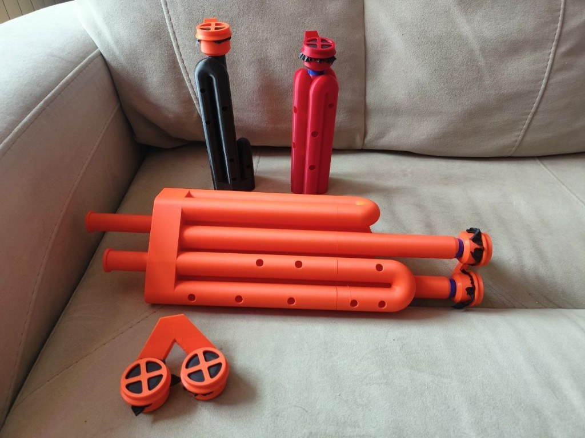

# Генератор басовой трубы



Программа строит параметрическую трубу под готовый модуль мембраны. Модуль она не моделирует: оставляет конец, который входит в его отверстие. По ноте или длине считает воздушный канал, укладывает его вязанкой в габарит печати и пишет STEP и STL.

Лицензия — MIT (`LICENSE`). Исходные заметки по акустике — `исследование трубы.txt`, порядок разработки — `ПЛАН.md`.

## Установка

Нужен **Python 3.11 или новее**. CadQuery тянет OpenCASCADE, VTK и SciPy: это сотни мегабайт, первая установка занимает несколько минут.

**Windows.** В папке проекта двойной щелчок по `Установить.bat` — он создаст `.venv` и скачает библиотеки. Потом `Запустить.vbs` (если Windows ругается на скрипты — `Запустить.bat`).

**Linux и macOS:**

```text
chmod +x install.sh
./install.sh
.venv/bin/python -m bass_tube.ui
```

**Вручную**, из корня репозитория:

```text
python -m venv .venv
```

Windows:

```text
.venv\Scripts\python.exe -m pip install -e ".[dev]"
.venv\Scripts\python.exe -m bass_tube.ui
```

Linux и macOS:

```text
.venv/bin/python -m pip install -e ".[dev]"
.venv/bin/python -m bass_tube.ui
```

Список пакетов без установки самого проекта: `requirements.txt`, с pytest — `requirements-dev.txt`. После `pip install -e .` окно также открывается командой `bass-tube`.

Готовые детали, которые генератор не строит (модуль мембраны, кольцо, двойной мундштук, сетка, референс трубы), лежат в `parts/`. Их печатают вместе с выводом программы. STEP и STL, которые вы сохраните из окна, в git не попадают.

## Устройство

Акустика, укладка и тело — отдельные пакеты. Общий вход для них — `TubeParams`.

| Пакет | Зона |
|---|---|
| `bass_tube.acoustics` | Имя ноты, частота, длина воздушного столба, поправки, профиль с переходником, короткая подстройка, слайдер, лад и отверстия |
| `bass_tube.layout` | Укладка прямых вязанкой, осевая линия, зазоры между каналами, привязка отверстий к прямым, высоты разрезов на печать, раскладка пары |
| `bass_tube.body` | Полое тело с цоколем, общее тело нескольких каналов, посадка, переходник, трубка подстройки, деталь слайдера, игровые отверстия, разрезы, экспорт STEP и STL |
| `bass_tube.ui` | Окно: тёмная тема, RU/EN, поля, отчёт, предпросмотр, сохранение |
| `bass_tube.design` | Весь расчёт одной трубы: `plan_design` без CAD и `build_design` с телом |
| `bass_tube.pair` | Второй голос: мелодия и дрон одной деталью, входы на 48 мм, `plan_voice_pair` и `build_voice_pair` |
| `bass_tube` | Параметры, строй и укладка |

Тело корпуса без разрезов — одна деталь CadQuery. Если включены разрезы на печать (`print_splits=True`), корпус и царга режутся на куски области печати. Стык — «папа — мама» без зазора и без клея, стенка делится пополам по радиусу (граница — середина стенки). Папа — внутренняя половина стенки нижнего куска: торчит вверх на 12 мм, по каналу совпадает с трубой, снаружи тоньше на полстенки. Мама — наружная половина стенки верхнего куска: канал у основания верхнего куска на 12 мм расширен на полстенки, и мама надевается на папу. В собранной трубе ни утолщений, ни сужений ни снаружи, ни в канале. При печати ни один кусок не начинается с узкой трубочки: папа наверху нижнего куска, мама — полая юбка полного диаметра у основания верхнего. Куски получаются одним разбиением тела (нижнему — всё ниже плоскости и цилиндр середины стенки над ней, верхнему — остальное), поэтому сходятся точно, а сумма их объёмов равна телу. При разрезах стенка не тоньше 1,6 мм: тоньше папа и мама по полстенки сломаются, и параметры отвергаются. Деталь слайдера при стенке вставки 1 мм не режется и должна влезть на стол целиком. Собранная вязанка может быть выше стола. Высоты разрезов считаются без CAD (`bass_tube.layout.print_cuts`): плоскость не проходит через колено, посадку модуля, дырку, цоколь и ход царги подстройки или слайдера. Папа (он выше разреза на 12 мм) не закрывает изнутри дырку и не упирается в верхнее колено или посадку. Каждый кусок, кроме верхнего, не выше стола вместе с папой. Стык ставится только на прямые, которые проходят сквозь разрез. Если компактная укладка не входит в стол, высокая выбирается по наименьшему числу кусков печати, при равных — по меньшему числу прямых; одна прямая в два метра на много кусков проигрывает вязанке чуть выше стола. Трубка подстройки печатается отдельно. Для тела нужен пакет `cadquery`.

## Как стоит деталь

Ось \(z\) смотрит вверх, стол печати — плоскость \(z = 0\). Модуль мембраны садится сверху, выход трубы внизу или сверху (см. ниже). Все прямые вертикальные. Снизу — сплошной цоколь по контуру прямых высотой до центров нижних разворотов: сбоку деталь выглядит как вязанка цилиндров на плоском дне, с этого дна она и печатается.

## Номинал стыка и переходник

Конец под модуль и труба задаются отдельно. Первые 8 мм от входа — прямая посадка, они входят в длину воздушного пути.

| Величина | Значение по умолчанию |
|---|---|
| Отверстие модуля | 19.63 мм |
| Наружный диаметр конца | пусто — отверстие минус 0,13 мм, то есть 19.5 мм |
| Зазор пары по диаметру | 0.13 мм |
| Длина посадки | не меньше 8 мм |
| Стенка | 2 мм |
| Канал конца | 15.5 мм |
| Наружный диаметр трубы | 19.5 мм |

Если труба толще или тоньше конца, после посадки идёт конус-переходник. Пустая длина переходника — конус с половинным углом 15°: \(\ell_t = |r_{\mathrm{труба}} - r_{\mathrm{конец}}| / \tan 15°\). Труба 30 мм при конце 19,5 мм даёт переходник около 19,6 мм. В отверстие модуля идёт конец, а не труба. Пустой конец или конец не тоньше отверстия молча становится «отверстие минус штатный зазор 0,13 мм» (`resolve_seat_diameter_mm`): труба 27 мм с концом 27 мм не отвергается, а получает конец 19,5 мм и переходник.

Скорость звука 343 м/с — константа мира, в окне её нет. Строй A4 = 440 Гц. Ноты пишутся с октавой, среднее до — C4. Поправка открытого конца по умолчанию \(0{,}6a\) по радиусу канала трубы. Поправки головки и изгибов по умолчанию нулевые; нуль головки означает, что она ещё не калибрована. Высота под модуль мембраны (`head_reserve_mm`) в канал не входит.

Наружный диаметр трубы главный. Под него сами поднимаются радиус разворота (чтобы колено не схлопнулось, трубы держали зазор и колено между соседними прямыми не касалось их общего соседа по шестиграннику: \(R \ge (D_o + \max(g, 0{,}5))/\sqrt3\)), дно цоколя (чтобы разворот не вылез под стол) и глубина габарита (чтобы одна труба влезла плашмя). Стенка ужимается, только если съела канал. Больший радиус, чем минимум, не трогается. Нулевой переходник при разных диаметрах заменяется конусом 15°.

## Как собрать параметры

Режим один. Либо нота с октавой, либо длина корпуса в миллиметрах.

```python
from bass_tube import tube_params

params = tube_params(
    note="C2",
    layout="bundle",
    straight_count=None,      # None — автоподбор
    max_height_mm=250,
    max_width_mm=150,
    max_depth_mm=150,
    head_reserve_mm=35,
    turn_radius_mm=11,
    gap_mm=1,
    trim_semitones=0,         # API: ноль — без трубки; в окне по умолчанию 1
    hole_count=0,             # API и окно: ноль — без дырок, максимум 8
    slider_kind="",           # "" / "end" / "u" / "uu" / "uauto"; с дырками вместе нельзя
    slider_semitones=0,       # полутонов вниз от верхней ноты; 0 — без слайдера
    slider_pairs=0,           # число U-колен; 0 — из схемы или автоподбор
    slider_clearance_mm=0.3,  # зазор канала и царги со всех сторон, не меньше 0,3
    print_splits=False,       # True — куски стола со стыками «папа — мама», стенка от 1,6 мм
    drone_note=None,          # нота второй трубы; None — один голос
    drone_trim_semitones=0,   # подстройка дрона вниз; 0 — без трубки
    scale="major",
)
params.bore_diameter_mm  # 15.5
params.delta_out_mm      # 4.65
```

Остальные поля: `outer_diameter_mm` и `seat_outer_diameter_mm` (труба и конец), `wall_thickness_mm`, `module_hole_mm`, `seat_length_mm`, `transition_length_mm` (None — конус 15°), `floor_mm` — дно цоколя под нижней точкой канала (по умолчанию 3 мм, должно быть толще стенки), `trim_semitones` — сколько полутонов вниз можно уйти выдвижной трубкой (в API по умолчанию 0), `slider_kind` — схема слайдера (`end` выдвижной конец \(\Delta L \approx x\), `u` одно U-колено \(\Delta L \approx 2x\), `uu` двойное U \(\Delta L \approx 4x\), `uauto` все нижние колена укладки, пусто — нет), `slider_semitones` — диапазон слайдера вниз от верхней ноты, `slider_pairs` — явное число U-колен (0 — из схемы или автоподбор), `slider_clearance_mm` — радиальный зазор между каналом корпуса и царгой со всех сторон (по умолчанию 0,3 мм, меньше нельзя), `print_splits` — резать корпус и царгу на куски стола со стыками «папа — мама» без зазора, стенка при этом не тоньше 1,6 мм (по умолчанию в API выключено, в окне включено), `drone_note` — нота дрона (None или пусто — один голос), `drone_trim_semitones` — подстройка дрона вниз (в API по умолчанию 0; в окне пустое поле при заданной ноте дрона — один полутон), `hole_count` — игровые отверстия до восьми (0 — без дырок), `scale` — лад от ноты корпуса (`major`, `natural_minor`, `melodic_minor`, `pentatonic`, `major_pentatonic`), `hole_diameter_mm` — диаметр дырки (по умолчанию 8 мм). Слайдер нельзя включить вместе с отверстиями. Если слайдер включён, трубка подстройки мелодии выключается сама. Дрон отверстий и слайдера мелодии не берёт.

## Строй

Труба считается закрытой у мембраны и открытой на выходе. Основной резонанс — четверть волны:

\[
f = f_{A4}\cdot 2^{(m-69)/12},
\qquad
L_{\mathrm{eff}} = \frac{c}{4f},
\qquad
L_{\mathrm{body}} = L_{\mathrm{eff}} - \Delta_{\mathrm{head}} - \Delta_{\mathrm{out}} - \Delta_{\mathrm{bends}} - \Delta_{\mathrm{transition}}.
\]

\(m\) — номер MIDI, C4 = 60, A4 = 69. Для ровной трубы \(\Delta_{\mathrm{transition}} = 0\). С переходником канал уже не одного сечения, и строй считается по матрицам передачи плоской волны: посадка — цилиндр, конус — лесенка из 64 коротких цилиндров, дальше труба до выхода. Длина остатка трубы находится в замкнутом виде, а \(\Delta_{\mathrm{transition}}\) — это разница с чистой четвертью волны. Для трубы 30 мм и конца 19,5 мм C2 даёт корпус 1315,24 мм, \(\Delta_{\mathrm{transition}} \approx -12{,}0\) мм.

В режиме длины заданный \(L_{\mathrm{body}}\) сохраняется, частота собирается обратно (с переходником — поиском корня), и программа называет ближайшую ноту. Отклонение лежит в поле `cents`.

Ориентир ровной трубы при канале 15.5 мм:

| Нота | Частота | Эффективная длина | Длина корпуса |
|---|---|---|---|
| C1 | 32.70 Гц | 2622 мм | 2617 мм |
| C2 | 65.41 Гц | 1311 мм | 1306 мм |
| G2 | 98.00 Гц | 875 мм | 870 мм |
| C3 | 130.81 Гц | 656 мм | 651 мм |

```python
from bass_tube import resolve_tuning

tuning = resolve_tuning(params)
tuning.body_length_mm          # около 1306
tuning.delta_transition_mm     # 0 без переходника
tuning.head_calibration_mark   # головка не калибрована
```

## Укладка

Длина корпуса режется на \(n\) вертикальных прямых, между соседними — разворот на 180° радиуса \(R\) (длина \(\pi R\), шаг между осями \(2R\), нужно \(2R \ge D_o + g\), \(R > D_o/2\) и \(\sqrt3 R \ge D_o + \max(g, 0{,}5)\)). Последнее — про шестигранник: колено между двумя соседними прямыми проходит на \(\sqrt3 R\) от оси их общего соседа. Если там почти касание, OCC теряет грань тора, и колено выходит «вывернутым»; на толстой трубе каналы сходятся у центральной прямой. При трубе 19,5 мм и зазоре 1 мм это \(R \approx 11{,}84\) мм. Первая прямая идёт от модуля вниз, развороты чередуются: первый снизу, следующий сверху.

**Вязанка** (`bundle`) — единственный режим. Прямые стоят в шестигранной сетке: центр, вокруг кольцо из шести, дальше следующие кольца. Каждое кольцо начинается рядом с последней пройденной прямой, так что соседние по оси прямые всегда соседи и в плане. Вход — на центральной прямой; при трёх и более прямых она поднята над верхними разворотами на \(R + D_o/2 + \) посадка \(+\) переходник, чтобы модуль не упирался в колена. Габарит печати подгоняется ограничителями в окне, отдельный плоский ряд для этого не нужен.

Центры нижних разворотов стоят на одной высоте цоколя \(z_b = \) дно \(+ R + D_i/2\). Прямых только нечётное число: последняя идёт вниз сквозь цоколь и открывается в столе. Одна прямая стоит на столе без цоколя. При подстройке последняя прямая не короче царги.

Число прямых: если `straight_count` не задан, перебираются нечётные \(n\) от 1 до 37 и берётся наименьшее, которое с резервом модуля входит в высоту, ширину и глубину. Меньше \(n\) — меньше колен. Чтобы деталь стала ниже и компактнее, уменьшите высоту габарита или задайте нечётное \(n\) явно. Чётное \(n\) отвергается.

Контрольная вязанка C2 (\(R = 11\) мм, зазор 1 мм, высота 250 мм): 7 прямых, обычная 149,79 мм, цоколь 21,75 мм, план 63,5 × 57,6 мм, высота 200,3 мм, с модулем 235,3 мм.

```python
from bass_tube import layout_coil

coil = layout_coil(params, tuning)
coil.straight_count        # 7
coil.columns               # центры прямых в плане
coil.straight_lengths_mm   # первая длиннее на подъём входа, последняя — на цоколь
coil.height_with_head_mm
```

## Осевая линия и зазоры

Ось — список участков в пространстве: вертикальная прямая и дуга 180° в вертикальной плоскости между двумя столбцами. \(s = 0\) — стык с модулем наверху первой прямой; посадка и переходник лежат на первой прямой. На стыках точка и касательная непрерывны, сумма длин равна корпусу.

В плотной вязанке наружные стенки соседних колен могут сливаться — это нормально, деталь всё равно одна. Не должны сходиться каналы: `check_channel_clearance` проходит ось с шагом 1 мм и проверяет, что между каналами несоседних участков остаётся не меньше стенки. Возвращает самую тонкую такую стенку (у контрольной вязанки 3,56 мм).

```python
from bass_tube import build_centerline
from bass_tube.layout import check_channel_clearance

line = build_centerline(coil, params.joint_length_mm)
line.sample(0).point               # вход модуля, верх центральной прямой
check_channel_clearance(line, params)
```

## Тело

Наружная часть собирается из кусков: посадка, конус и наружная стенка — одна протяжка круга по всей оси, как и канал (у слайдера — по кускам между пропущенными коленами); к ним добавляется цоколь. Раньше прямые были отдельными цилиндрами с нахлёстом в колена, и OCC на почти совпадающих поверхностях молча выбрасывал целые участки стенки (в паре мелодия + дрон — до половины колен), хотя тело считалось валидным. Теперь после слияния проверяются точки середины стенки на каждом участке оси: если что-то пропало, куски сливаются по одному, а если и так пропало — `BodyError`. Цоколь — выпуклая оболочка столбцов, отодвинутая на радиус трубы. Канал вычитается одной протяжкой круга по всей оси, затем отдельно посадка и конус. Такой порядок выбран потому, что OCC ломает булевы операции на совпадающих поверхностях. Сборка проверяет, что вышло одно валидное тело, канал открыт у входа, на середине и у выхода. Контрольная вязанка собирается примерно за секунду и около 350 МБ памяти.

```python
from bass_tube.design import build_design
from bass_tube.body import export_tube_body

design = build_design(params)
export_tube_body(design.body, "tube.step", "tube.stl")
if design.tuner is not None:
    export_tube_body(design.tuner, "tube-подстройка.step", "tube-подстройка.stl")
if design.slider_body is not None:
    export_tube_body(design.slider_body, "tube-слайдер.step", "tube-слайдер.stl")
```

## Подстройка

Это не слайдер на октаву. Нота в параметрах — верхняя: трубка задвинута, корпус считается на неё. `trim_semitones` — сколько полутонов вниз можно уйти, выдвинув трубку из открытого конца в дне. Посадка мембраны неподвижна.

Ход равен разнице длин корпуса нижней и верхней ноты. Вставленный кусок царги в длину пути не считается дважды: воздух идёт внутри трубки. Снаружи у трубки фланец-упор (~2,5 мм), чтобы она не провалилась в канал. В окне по умолчанию один полутон вниз; в API без поля — ноль, трубки нет. Если включён слайдер, подстройка сама становится нулём, поле в окне гаснет.

Прямых всегда нечётное число, последняя не короче царги (перекрытие 12 мм плюс ход). Чётное число отвергается. Трубка печатается отдельной деталью.

## Слайдер

Схемы не смешиваются и не сочетаются с отверстиями. Нота в параметрах — верхняя: слайдер задвинут, корпус считается на неё. `slider_semitones` — сколько полутонов вниз можно уйти на полном ходу. Трубку подстройки выключать не нужно: при слайдере она гаснет сама. В окне выбранная схема с пустым полем полутонов ставит один полутон, чтобы деталь появилась.

- **Выдвижной конец** (`slider_kind="end"`, \(q = 1\)): путь удлиняется примерно на ход \(x\). Царга вставляется в последнюю прямую в дне, как трубка подстройки.
- **U-колено** (`slider_kind="u"`, \(q = 2\times\)число колен): удлиняются ветви нижних разворотов. По умолчанию одно колено (\(q = 2\)). `slider_pairs` задаёт больше колен: три колена — \(q = 6\), нужно минимум семь прямых. Обе прямые каждого колена доходят до дна; верхние колена между ними остаются в корпусе.
- **Двойное U** (`slider_kind="uu"`, \(q = 4\)): два нижних колена, четыре ветви. Нужно минимум пять прямых.
- **U авто** (`slider_kind="uauto"`): забирает все нижние колена выбранной укладки, кроме выхода. Больше прямых — больше сегментов царги, короче ход.

Цоколь детали U такой же высокий, как у трубы: оболочка столбов от стола до центров колен, не тонкий фланец.

Положения полутонов по ходу не равномерны: каждый следующий полутон требует большего смещения, чем предыдущий. Вложенные участки телескопа в длину не считаются дважды. Посадка мембраны неподвижна.

`slider_clearance_mm` — зазор между внутренностью трубы и царгой **со всех сторон**, не меньше 0,3 мм (пустое поле окна — 0,3). Наружный диаметр царги: канал корпуса минус два зазора.

Печатается сложенный корпус. Высота на полном ходу — размер игры: она пишется в отчёт и область печати не режет. Сама деталь слайдера должна влезть на стол любой стороной; резать её нельзя: стенка вставки 1 мм тоньше 1,6 мм, стык «папа — мама» на ней сломается. Если не влезает, программа пишет это и **диапазон сама не укорачивает**. Октава C3→C2 у одного U даёт ход около 328 мм. Больше колен укорачивает царгу, разрезы позволяют собрать трубу выше стола; ветви корпуса всё равно должны принять царгу.

```python
params = tube_params(
    note="C3",
    slider_kind="uauto",
    slider_semitones=2,
    print_splits=True,
    layout="bundle",
    max_height_mm=250,
    max_width_mm=150,
    max_depth_mm=150,
    head_reserve_mm=35,
    turn_radius_mm=11,
    gap_mm=1,
)
```

## Отверстия

Нота корпуса — тоника лада. Дырок не больше восьми: пальцев больше нет. Открываются по очереди от выходного конца, не хроматикой: все закрыты дают тонику, первая открытая — следующую ступень. Лады: мажор, натуральный минор, минор мелодический, пентатоника, мажорная пентатоника.

Координата \(s\) считается передаточными матрицами цилиндров и боковой проводимостью дырки. Закрытые дырки остаются боковым объёмом и слегка сдвигают основную ноту; ошибка каждой аппликатуры пишется в отчёте в центах.

Под дырки укладка подбирается целиком, а не сдвигом по одной паре. Правила печати жёсткие: все нижние колени на цоколе, выход в дне, вход — выше самого высокого верхнего колена на радиус, полтрубы и посадку, деталь с модулем в высоте габарита. Свобода — нечётное число прямых, высота каждой пары (подъём равен следующему спуску) и длина первой прямой; ось всегда равна корпусу. Решатель (`bass_tube.layout.hole_fit`) идёт по парам от выхода к входу на сетке 0,5 мм и ищет высоты, при которых каждое колено (отрезок \(\pi R\) по оси) попадает в промежуток между дырками с отступом. Дырка не ставится на внутреннюю прямую, в цоколь и в царгу подстройки; акустика тоже не кладёт туда первую дырку.

Среди подходящих высот решатель выбирает удобную пальцам раскладку (`bass_tube.layout.fingers`). Меряется расстояние по наружной стенке между центрами соседних по открыванию дырок: на одной прямой — разница \(s\), через колено — гипотенуза из расстояния в плане между точками дырок и разницы высот. Колено между двумя дырками превращает 80–120 мм по оси в 30–50 мм под пальцами. Удобно около 30 мм, между руками (средняя пара при пяти и более дырках) — до 55 мм, ближе 18 мм пальцы не помещаются. Штраф — квадрат растяжки плюс учетверённый квадрат тесноты. Решатель складывает штрафы по парам в том же проходе от выхода к входу, поэтому ради удобства пальцев он сам добавляет колена между дырками и выбирает больше прямых. Штрафы, отличающиеся меньше чем на 5 мм², считаются равными, и тогда берётся самая низкая деталь. Отчёт пишет получившиеся расстояния. Первую пару у выхода не всегда удаётся сблизить: у низких нот (G1) гнездо подстройки занимает около 116 мм выходной прямой, и колено между первыми двумя дырками не встаёт.

Порядок перебора: число прямых от трёх вверх, и ещё на 8 прямых дальше первой подошедшей укладки. Для каждого числа сначала удобный отступ дырки от колена (половина дырки + 6 мм), потом минимальный (половина дырки + 1,5 мм: вырез целиком на прямой и над цоколем). Для каждого отступа — радиус колена из окна, потом самый тесный под диаметр и зазор (колено короче — между дырками нужно окно меньше). Из всех найденных укладок берётся наименьший точный штраф пальцев. Штрафы в пределах 200 мм² от лучшего (около 14 мм лишней растяжки на одну пару) считаются равными, и среди них выигрывает удобный отступ, потом меньше прямых, потом ниже деталь. Раскладка без растяжки с удобным отступом останавливает перебор. Если радиус пришлось затянуть, отчёт это пишет. Каждая укладка ещё проверяется на стенку между каналами.

Дырка смотрит наружу и доворачивается к общей лицевой стороне (среднее «наружу» всех прямых с дырками), но не больше чем на 45° и так, чтобы сверло не задевало соседние трубы: пальцы ложатся с одной стороны вязанки.

Слайдер и отверстия вместе не генерируются: это разные способы управления длиной и строем.

С разрезами, если в стол дырки не легли, укладка под них ищется выше стола: на два куска, на три и так до шести, и каждая проверяется на разрезы мимо колен, дырок и царги.

Если ни одна укладка не подошла, отказ называет, что поможет: высоту печати, при которой дырки лягут (шаг 10 мм, до +200 мм), и сколько дырок этого лада влезает в текущую. Контроль на параметрах окна по умолчанию (250 мм, резерв 35 мм, R = 11 мм): 8 дырок на проверенных нотах от A1 до B2 во всех пяти ладах, с подстройкой и без, ложатся, кроме B2 натурального минора; у C3 не ложатся четыре лада из пяти — нужно около 290–300 мм высоты или 6–7 дырок.

```python
params = tube_params(
    note="C2",
    hole_count=3,
    scale="major",
    hole_diameter_mm=8,
    layout="bundle",
    max_height_mm=250,
    max_width_mm=150,
    max_depth_mm=150,
    head_reserve_mm=35,
    turn_radius_mm=11,
    gap_mm=1,
)
```

## Второй голос

Две отдельные мембраны: мелодия и дрон — **одна деталь** с двумя каналами. Насадку на две мембраны генератор не строит: ставит оси входов на **48 мм** между центрами и на одну высоту, чтобы ваша насадка легла плашмя. Камера подачи в модели не появляется, каналы внутри не соединяются — общим воздухом программа их не связывает. Обе трубы стоят на столе, общий цоколь по выпуклой оболочке всех прямых связывает их в одно тело.

Мелодия считается как одна труба: вход в центре её вязанки. Дрон (`drone_note`, своя подстройка `drone_trim_semitones`, без дырок и слайдера мелодии) укладывается под высоту входа мелодии: первая прямая от входа до цоколя, пары одной высоты добирают длину корпуса, последняя пара при нужде выше — под царгу подстройки. Путь дрона по сетке обращён: вход на краю его вязанки, выход в центре. Положение дрона ищется перебором (`bass_tube.layout.pair_layout`): направление на вход дрона через 5°, поворот вязанки дрона на шаг шестигранной сетки прямо и зеркально (колени ориентированы как у одиночной трубы — на произвольных углах булевы операции OCC изредка дают невалидное тело). Оси и колени разных труб в плане не ближе диаметра плюс зазор, перед каждой дыркой мелодии 25 мм свободны от дрона, общий план влезает в стол. Из подходящих берётся самый компактный.

Если пара не встала, а разрезы включены, мелодия собирается выше — на два куска стола, на три и дальше: вход выше, обеим трубам нужно меньше прямых, план уже. При разрезах режется вся пара целиком, по тем же правилам, что одна труба.

```python
from bass_tube.pair import build_voice_pair, export_pair

params = tube_params(
    note="C2",
    drone_note="G1",
    drone_trim_semitones=1,
    layout="bundle",
    max_height_mm=250,
    max_width_mm=150,
    max_depth_mm=150,
    head_reserve_mm=35,
    turn_radius_mm=11,
    gap_mm=1,
)
pair = build_voice_pair(params)
export_pair(pair, "труба.step", "труба.stl")
```

`plan_voice_pair` — та же раскладка без CAD (для проверок). В окне пустая нота дрона — один голос. Пустая подстройка при заданной ноте дрона — один полутон вниз. Сохранение пишет общую деталь как выбранный файл (или её куски «-корпус-N»), трубку подстройки мелодии — «-подстройка», дрона — «-подстройка-дрон».

## Окно

После установки двойной щелчок по `Запустить.vbs` открывает интерфейс без чёрной консоли (`pythonw` из `.venv`). Если Windows блокирует скрипты — `Запустить.bat`. Из консоли: `python -m bass_tube.ui` или `bass-tube`.

Окно тёмное, с медным акцентом: шапка, карточки параметров слева, предпросмотр справа, отчёт внизу. В шапке сегмент **RU | EN** переключает язык подписей, подсказок, списков, статуса и отчёта. Выбор пишется в `~/.bass_tube_ui.json` и поднимается при следующем запуске. Имена файлов STEP/STL остаются русскими (`труба-C2`, `-подстройка`, `-слайдер`). Отказы расчёта из ядра пока на русском.

В окне задаются нота или длина корпуса, труба, конец под модуль с переходником, габарит, укладка вязанки (нечётное число прямых, радиус, зазор, дно), подстройка в полутонах вниз, отверстия (число до 8, лад, диаметр), слайдер (схема, полутоны вниз, зазор царги), дрон (нота и своя подстройка) и поправки. Скорости звука нет. Наружный диаметр главный: стенка, дно, радиус разворота и глубина подтягиваются в полях сами, но только когда ввод закончен. Это происходит при уходе из поля, по Enter, при выборе в списке и перед «Построить». Пока число набирается, соседние поля не трогаются. В числовые поля набираются только цифры, минус и одна запятая или точка. Нота, нота дрона, диаметр дырки и A4 — списки, в которые можно вписать своё значение. Лад, схема слайдера, разрезы на печать («да»/«нет» или yes/no) и число прямых («авто»/auto или нечётное) выбираются только из списка. Подстройки, число дырок, полутоны и колена слайдера — счётчики со стрелками. Колёсико над списком или счётчиком листает форму и не меняет значение. Пустые поля открытого конца, радиуса разворота и переходника считает расчёт. Пустой конец под модуль — под отверстие; подпись канала конца показывает подобранный диаметр. Лад по умолчанию — натуральный минор (C–D–D#–F–G–G#–A#). Пустая подстройка — без трубки. Пустое число отверстий — без дырок. Пустой слайдер — без слайдера; выбранная схема с пустыми полутонами ставит один полутон. Пустой зазор слайдера — 0,3 мм со всех сторон. Нота дрона «нет»/none — один голос. «Построить» показывает отчёт и деталь видом сбоку сверху, дном вниз; трубка подстройки или деталь слайдера стоит справа от корпуса; если задан дрон, показывается общая деталь с входами на 48 мм. Левая кнопка вращает, правая сдвигает, колёсико меняет масштаб. «Сохранить…» спрашивает путь к STEP корпуса, STL с тем же именем кладётся рядом; если есть подстройка, рядом пишется ещё пара файлов с суффиксом «-подстройка», если есть слайдер — пара с суффиксом «-слайдер», если есть дрон — одна общая деталь и «-подстройка-дрон». Если поля изменились после построения, сохранение ждёт нового расчёта.

## Что отвергается

`tube_params` поднимает `ParamsError` со всеми причинами сразу (`reasons`):

- одновременно заданы нота и длина корпуса, либо не задано ни то ни другое;
- нота без октавы или не в записи вида `C2` / `F#3`;
- посадка короче 8 мм; стенка нулевая или отрицательная;
- отрицательный переходник;
- неизвестная укладка (есть только вязанка), число прямых не целое, меньше 1 или чётное;
- отрицательная или дробная подстройка в полутонах;
- слайдер вместе с отверстиями; ход слайдера без схемы; неизвестная схема; зазор слайдера меньше 0,3 мм со всех сторон;
- больше восьми отверстий, неизвестный лад, диаметр дырки не меньше канала;
- нота дрона без октавы или не в записи вида `C2`;
- габарит неположительный, резерв под модуль съедает всю высоту, зазор отрицательный.

`layout_coil` поднимает `LayoutError`, не меняя ноту: мало высоты, ширины или глубины (с лучшим достижимым размером), прямых больше 37, прямые выходят короче стыка, чётное число прямых или последняя прямая короче царги. Если дырки не ложатся на наружные прямые ни при одной укладке с коленами на цоколе — тоже `LayoutError`, с подсказкой нужной высоты печати и допустимого числа дырок. Если деталь слайдера не влезает на стол ни одной стороной — тоже `LayoutError`: ход сам не укорачивается, отказ называет размер детали. Высота собранного инструмента на полном ходу в область печати не входит. При разрезах царга подстройки или слайдера вместе с папой стыка над ней должна поместиться в нижний кусок: разрез через ход царги не ставится, и отказ называет длину царги. При разрезах стенка тоньше 1,6 мм отвергается `ParamsError`. Если дрон не встаёт рядом с мелодией на шаге 48 мм, короток для входа на этой высоте или его царга не встаёт в последнюю прямую — тоже `LayoutError` с тем, что поменять. `plan_holes` поднимает `HoleError`, если царга подстройки занимает место первой дырки (подстройка на 2 полутона при ладе с первой ступенью в целый тон): уменьшите подстройку или диаметр дырок. `check_channel_clearance` — если каналы соседних колен сходятся ближе стенки. Радиус разворота и дно под диаметр трубы подгоняет `tube_params`, а не отказ укладки.

## Проверка

Из каталога проекта, после `Установить.bat` или `pip install -e ".[dev]"`:

```text
.venv\Scripts\python.exe -m pytest
```

Тесты тела и окна собирают CadQuery-детали (по секунде и 350–450 МБ на сборку); тяжёлых сборок корпуса две, плюс окно с контрольной C2, сборка U-слайдера, пары C2+G2 и G1+D2 и куски разрезов.

На Linux и macOS: `.venv/bin/python -m pytest`.

Большой аудит без CAD (`tests/test_audit.py`) в обычном прогоне пропускается. Он считает все трубы G1…G2 с 6–8 дырками в пяти ладах при пяти габаритах (стол 250/200/150 мм, дырка 6/8/10 мм, подстройка 0/1, с разрезами и без) и пары с дроном на тонику и квинту, в восемь процессов, около пяти минут:

```text
python -m pytest -m audit
```
